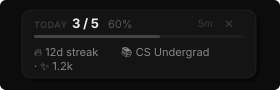

# GitHub Daily Tracker

> Track your daily GitHub commits. Build your aura. Go cracked.

A Chrome extension that turns your commit habit into a game — streak tracking, aura points, rank progression, and a daily reminder to keep you shipping.

---

  

---

## In-page overlay

A live widget appears on every `github.com` page — no need to open the popup.

  

Shows today's commit progress, current streak, rank, and aura. Updates automatically in the background. Dismiss it with ×.

---

## Install

1. Clone or download this repo
2. Open Chrome → `chrome://extensions`
3. Enable **Developer Mode** (top-right toggle)
4. Click **Load unpacked** → select the `github-daily-tracker` folder
5. Click the extension icon in the toolbar
6. Open ⚙️ **Settings** (inline, no new tab), enter your GitHub username
7. Set your daily commit target and reminder time

Done. Go get cracked.

---

## Rank System

| Streak | Rank | Tagline |
|--------|------|---------|
| 0–2 days | 🧳 Tourist | just visiting |
| 3–6 days | ☕ Bay Area Intern | learning the ropes |
| 7–13 days | 📚 CS Undergrad | pulling all nighters |
| 14–20 days | 🎓 Stanford Kid | thinks he's cracked |
| 21–29 days | ⚡ YC Founder | shipping at 3am |
| 30+ days | 🧠 CRACKED | no further questions |

---

## Aura System

Aura is your cumulative developer energy. It never resets — only grows or shrinks.

| Action | Change |
|--------|--------|
| Each new commit today | +10 |
| Hit your daily target | +50 |
| Extend your streak | +100 |
| Streak breaks | −100 |

---

## #CRACKED Bar

Tracks consecutive days you've hit your target. Fill it over **30 days** to permanently unlock the 🧠 CRACKED rank. Breaking your streak resets it.

---

## How it works

- Contributions are fetched from GitHub's public endpoint — **no API key or login required**
- Background fetches run every 30 minutes automatically
- The toolbar icon turns **green** when you've hit today's target, with a live commit badge
- All data (streak, aura, history) is stored locally in `chrome.storage.local`

---

## Features

- Live commit count from GitHub (no API key)
- In-page overlay widget on every `github.com` page
- Streak tracking with longest-streak memory
- Aura point system
- 30-day #CRACKED bar with permanent achievement
- 6-tier rank progression
- Inline settings — configure without leaving the popup
- Daily reminder notification at a time you choose
- Green/red toolbar icon + live commit badge

---

## License

MIT
