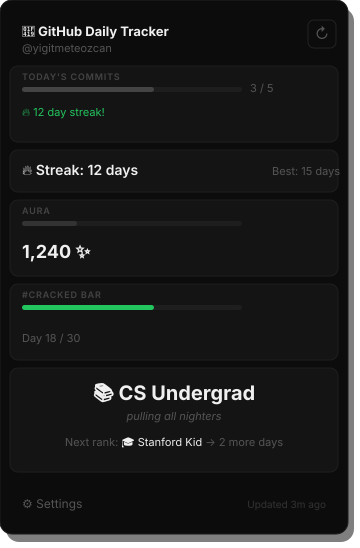

# 🐙 GitHub Daily Tracker

> Track your daily GitHub commits. Build your aura. Go cracked.

A Chrome extension that turns your GitHub commit habit into a game — streak tracking, aura points, cracked rankings, and daily reminders to keep you shipping.

---

## Screenshot

---

## Install

1. Clone or download this repo
2. Open Chrome → `chrome://extensions`
3. Enable **Developer Mode** (top right toggle)
4. Click **Load unpacked**
5. Select the `github-daily-tracker` folder
6. Click the extension icon in the toolbar
7. Go to ⚙️ Settings, enter your GitHub username
8. Set your daily target

Done. Go get cracked.

---

## Rank System

| Streak | Rank | Tagline |
|--------|------|---------|
| 0–2 days | 🧳 Tourist | just visiting |
| 3–6 days | ☕ Bay Area Intern | learning the ropes |
| 7–13 days | 📚 CS Undergrad | pulling all nighters |
| 14–20 days | 🎓 Stanford Kid | thinks he's cracked |
| 21–29 days | ⚡ YC Founder | shipping at 3am |
| 30+ days | 🧠 CRACKED | no further questions |

---

## How Aura Works

Aura is your cumulative developer energy — it never resets (only grows or shrinks).

| Action | Aura Change |
|--------|------------|
| Each commit today | +10 per commit |
| Hit your daily target | +50 bonus |
| Extend your streak | +100 bonus |
| Streak breaks | −100 |

The toolbar icon turns **green** when you've hit your target, **red** when you haven't. The badge shows your live commit count.

---

## How the #CRACKED Bar Works

The CRACKED Bar tracks consecutive days you've hit your target. Fill it over 30 days to unlock the permanent **🧠 CRACKED** achievement. If your streak breaks, it resets.

---

## Data Source

Contributions are fetched from GitHub's public contributions endpoint — no API key or authentication required. Checks run every 30 minutes automatically.

---

## Features

- Live commit count from GitHub (no API key needed)
- Streak tracking with longest streak memory
- Aura point system
- 30-day #CRACKED bar
- 6-tier rank system
- Daily reminder notification at your chosen time
- Green/red toolbar icon + commit badge
- Dark theme matching GitHub's UI

---

## License

MIT
